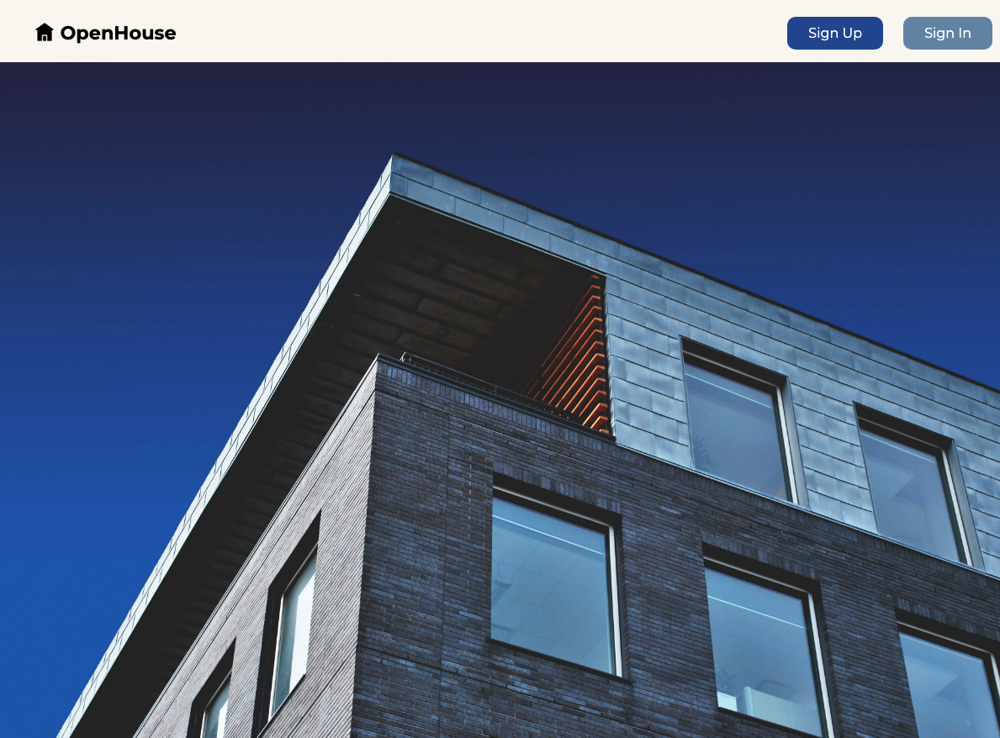

<h1>
  MEN Stack Referencing Related Data
  Openhouse
</h1>

## About

This module is all about building a robust MEN (MongoDB, Express.js, Node.js) stack application. We'll be creating "OpenHouse," a real estate app that allows users to keep track of and favorite property listings. Throughout this code-along, you’ll learn about referencing related data within user models using Mongoose and MongoDB. Additionally, this module guides you through styling your application, helping you create a polished, portfolio-worthy project. Designed for intermediate learners with a background in full-stack JavaScript development, "OpenHouse" offers practical experience in managing data relationships in full stack web applications.

## Content

| Lesson                                                                                                                   | Skills                                                                    |
| ------------------------------------------------------------------------------------------------------------------------ | ------------------------------------------------------------------------- |
| [Setup](./setup/README.md)                                                                                               | Setting up the development environment.                                   |
| [Setting the Stage](./setting-the-stage/README.md)                                                                       | Developing User Stories and an ERD.                                       |
| [Build the Listing Model](./build-the-listing-model/README.md)                                                           | Creating a model for the listing resource.                                |
| [Build and Use the Listings Controller](./build-and-use-the-listings-controller/README.md)                               | Require and mount a controller file.                                      |
| [Add Route Middleware](./add-route-middleware/README.md)                                                                 | Create middleware to check authentication and pass user data to the view. |
| [Build the Navigation Bar Partial](./build-the-navigation-bar-partial/README.md)                                         | Create NavBar partials.                                                   |
| [Build the New Page](./build-the-new-page/README.md)                                                                     | Construct a New page view with a form for user input.                     |
| [Build Create Functionality](./build-create-functionality/README.md)                                                     | Implementing create functionality.                                        |
| [Build the Listings Landing Page](./build-the-listings-landing-page/README.md)                                           | Construct a landing page for a resource.                                  |
| [Add Index Functionality to the Listings Landing Page](./add-index-functionality-to-the-listings-landing-page/README.md) | Applying the `populate()` method to index functionality.                  |
| [Build the Show Page](./build-the-show-page/README.md)                                                                   | Displaying a single resource on its own page.                             |
| [Build Delete Functionality](./build-delete-functionality/README.md)                                                     | Securely deleting a resource with protected controller actions.           |
| [Style the Application](./style-the-application/README.md)                                                               | Adding CSS to style the application                                       |
| [Build the Edit Page](./build-the-edit-page/README.md)                                                                   | Building an edit view.                                                    |
| [Build Update Functionality](./build-update-functionality/README.md)                                                     | Securely updating a resource with protected controller actions.           |
| [Add Favorites to the Listing Schema](./add-favorites-to-the-listing-schema/README.md)                                   | Implementing many-to-many relationships in MongoDB.                       |
| [Add Favorites Functionality to the Show Page](./add-favorites-functionality-to-the-show-page/README.md)                 | Implementing the functionality to favorite a resource.                    |
| [Add Unfavorite Functionality to the Show Page](./add-unfavorite-functionality-to-the-show-page/README.md)               | Implementing the functionality to unfavorite a resource.                  |
| [Wrap Up](./wrap-up/README.md)                                                                                           | Review of key concepts                                                    |
| [Formatting Currency](./formatting-currency/README.md)                                                                   | Formatting currency in JavaScript.                                        |
| [Viewing a User's Favorite Listings](./viewing-a-users-favorite-listings.md/README.md)                                   | Displaying related user data.                                             |

## References

📖 [Reference Materials](./references/README.md)

**Find a 👾 bug 👾 or have suggestions? [Let us know](https://ga-curriculum.github.io/universal-resources-internal/module-feedback.html)!**
