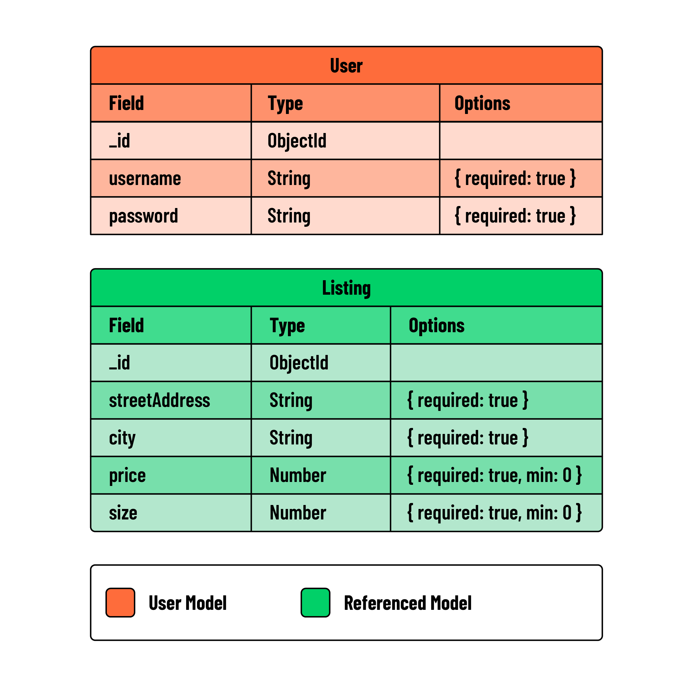
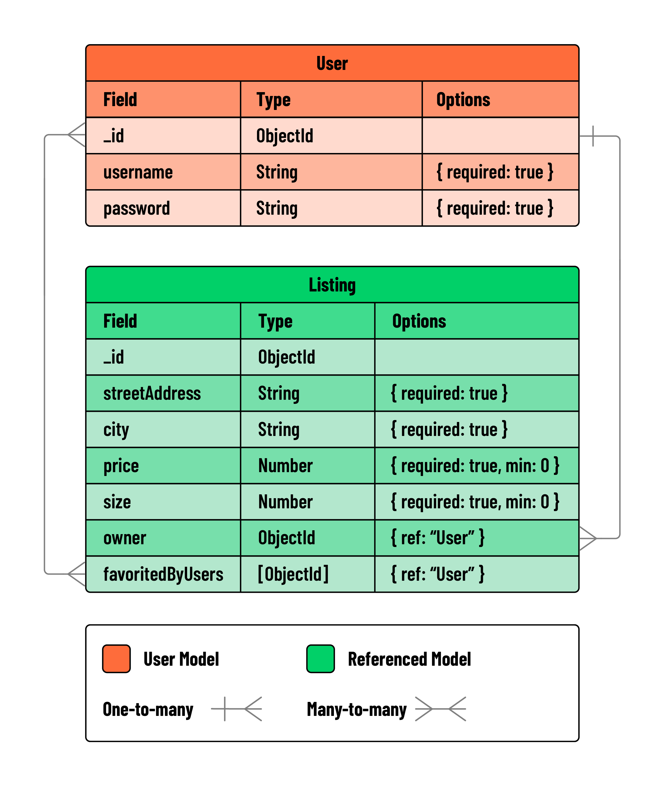

<h1>
  Openhouse
  Setting the Stage
</h1>

**Learning objective:** By the end of this lesson, students will get experience with creating User Stories and ERDs for a MEN stack application.

## OpenHouse

During this module, we are going to create a real estate application called OpenHouse. This application will allow users to create listing profiles for the properties they own. They will be able to track details like:

- Street address
- City
- Price
- Size in sq ft
- Owner
- Users who have favorited the listing

Users can browse all listings, access listing details, create new listings, edit existing ones, and delete listings. Additionally, users can favorite or unfavorite a listing.

The application includes user authentication and authorization. Users must sign up and log in to create, edit, or delete a listing. Moreover, users can only edit or delete a listing if they are its owner.

## Project planning

Project planning is crucial for any project, helping to understand its scope and divide it into manageable parts. Two key tools in this process are User Stories and Entity-Relationship Diagrams (ERDs).

- User Stories describe features from the user's perspective, to clarify the application's functionality and user experience.
- ERDs, outline the system's data structure.

Starting with User Stories and then developing ERDs is often beneficial, as it ensures a well-rounded approach to both user needs and data design.

### User stories

User stories are a way to describe an application's functionality from a user's perspective. They are often written in the format of:

> As a user, I want to do X for Y reason.

This is an excellent way to describe and break down the functionality of an application. It is also an excellent way to get a sense of what the user experience will be like. User story creation is often an iterative process, and it is normal to start with a few user stories and then add more as the project progresses.

This being an iterative process, there is also often a way to track what is considered the minimum viable product (MVP) for an application - the minimum amount of functionality an application needs to be regarded as a viable product.

Let's create some user stories for our real estate application.

As a user:

- As a new user, I want to easily create a new account, so I can access personalized features and services on the platform.
- As a registered user, I want to log in to my account, so I can access my personal data and interact with the platform's features.
- As a logged-in user, I want the ability to log out of my account, to ensure its secure when I'm not using the platform.
- As a user, I want to create listings for my real estate properties, to advertise them to potential buyers or renters.
- As a user, I want to view all the listings created by every user on a single page, to explore available properties.
- As a user interested in a property, I want to view all details of a listing, including information about its owner, by following a link from the main listing page.
- As a user who owns a listing, I want the option to delete a listing I created, in case the property is no longer available.
- As a user who owns a listing, I want to edit details of my listings, to ensure the information stays up-to-date.
- As a user, I want to see the number of favorites a listing has received, to gauge its popularity and potential demand.
- As a user, I want to favorite a listing, so I can easily find and review it later.
- As a user, I want to remove listings from my favorites, to keep my favorites list relevant to my current interests.
- As a user, I want a profile page to view both the listings I own and the listings I've added to my favorites, so that I can easily review everything in one place.

Developing these user stories helps us understand the required functionalities for our application. Additionally, they serve as a practical checklist to guide our development process.

### ERDs

Entity relationship diagrams (ERDs) are a way to describe the data that will be used in an application. Using the user stories we created above, we know we must keep track of users and listings. Before considering the relationships between users and listings, let's consider what data we need to keep track of for each resource.

For users, we need to keep track of:

- Username - String and is required
- Password - String and is required

For listings, we need to keep track of:

- Street address - String and is required
- City - String and is required
- Price - Number, minimum of 0, and is required
- Size - Number, a minimum of 0, and is required

 

> 💡 We are intentionally leaving off the favorites feature for now. We will add a field/value pair for this feature when we add relationships to our ERD.

Now, let's add in the relationships. First, let's dive into the relationship between users and listings. We want a user to be able to create, edit, and delete multiple listings they own. This is a one-to-many relationship; a user can have many listings, but a listing can only have one user.

We also have the favorites functionality that we will be adding later. A user can favorite many listings, and a listing can be favorited by many users. This is a many-to-many relationship. To represent this in our ERD, we must have a new field name to house the relationship. We will call this field `favoritedBy`.

 

