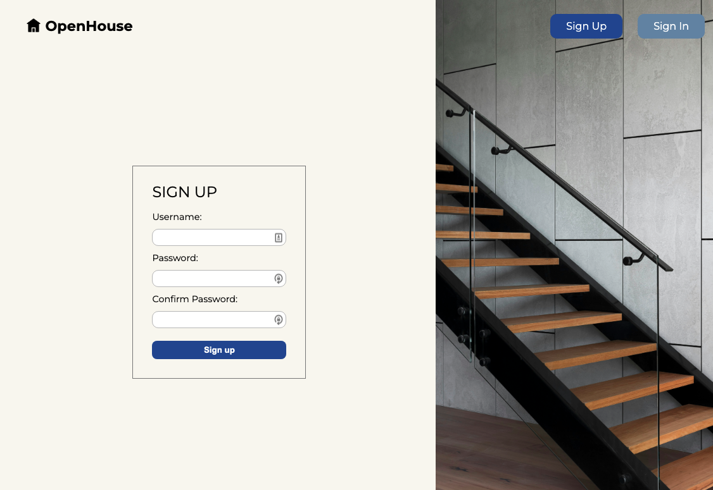
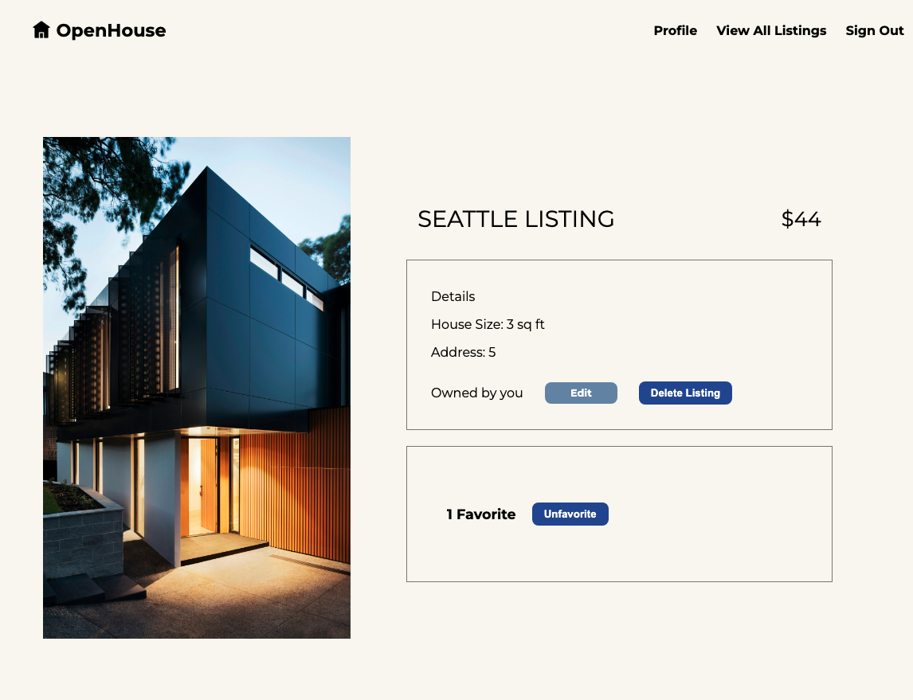
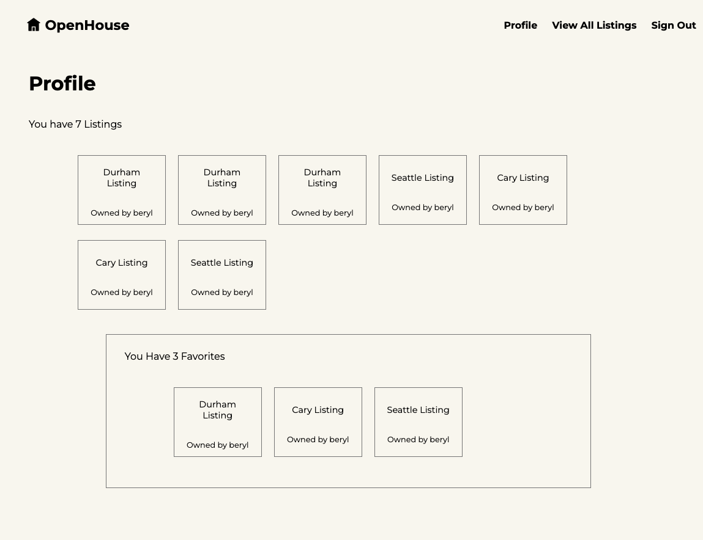
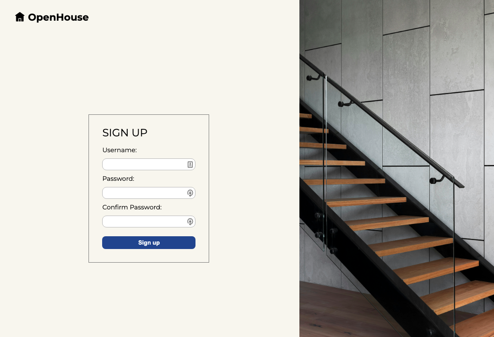

<h1>
  <span class="headline">Openhouse</span>
  <span class="subhead">Style the Application</span>
</h1>

Now that you've built a MEN-stack app with referencing, it's time to add some style. If you follow all of the steps of this level up you'll have an app that looks like this:








## Setting up the middleware and static files

1. First we need to add our middleware so that our app can read and apply our css rules. Add the following code to `server.js`:

```javascript
app.use(express.urlencoded({ extended: false }));
app.use(methodOverride('_method'));
// app.use(morgan('dev'));

//new code below this line ----
app.use(express.static(path.join(__dirname, 'public')));
//new code above this line ---

app.use(
  session({
    secret: process.env.SESSION_SECRET,
    resave: false,
    saveUninitialized: true,
  })
);
```

The `express.static` middleware is designed to serve static files like CSS stylesheets.

2. Now we need to add require `path`, which we use in the `express.static` middleware. Add this to `server.js`:

```javascript
const port = process.env.PORT ? process.env.PORT : '3000';

//new code below this line ----
const path = require('path');
```

3. Next, we need to create a `public` folder. This is crucial because in the code above we designated the `public` directory as the one that will hold all of our static files for this app. Create the folder with this command:

```bash
mkdir public
```

4. Let's create a `stylesheets` folder inside our public folder:

```bash
mkdir public/stylesheets
```

5. Now we need to create a stylesheet called `style.css`, and link it at the top of all of most of our `views`. Create the stylesheet using this command:

```bash
touch public/stylesheets/style.css
```

and link it to the top of all of our `ejs` files except for `_navbar.ejs`:

```html
<meta name="viewport" content="width=device-width, initial-scale=1.0" />

// new code below this line ----
<link rel="stylesheet" href="/stylesheets/style.css" />
```

## Applying general rules

We're going to set some basic rules for our whole app to establish a consistent design.

1. Import our Google Font at the top of `style.css`:

```css
@import url('https://fonts.googleapis.com/css2?family=Montserrat:wght@400;500;700');
```

This font is a great choice for our theme and branding because it's clean, simple, and modern looking.

> 💡 Feel free to use whatever font you want here! If you want to deviate from the style we're working towards that's perfectly fine!

2. Add these rules to `style.css`:

```css
body {
  font-family: 'Montserrat', sans-serif;
  display: flex;
  flex-direction: column;
  height: 100vh;
  width: 100vw;
  background-color: #f9f7f0;
}
```

Here, we're assigning the font that we imported, setting a common background color, and declaring the `<body>` element to be a `flexbox` with an orientation of `flex-direction: column`.

## Styling the landing page

1. change the contents of `_navbar.ejs` to:

```html
<nav>
  <% if(user) { %>
  <div class="landing-header">
    <div class="logo-container">
      <div class="house-icon"></div>
      <h1>OpenHouse</h1>
    </div>
    <div class="nav-links">
      <a href="/users/profile">Profile</a>
      <a href="/listings">View all Listings</a>
      <a href="/auth/sign-out">Sign Out</a>
    </div>
  </div>

  <% } else { %>
  <div class="landing-header">
    <div class="logo-container">
      <div class="house-icon"></div>
      <h1>OpenHouse</h1>
    </div>
    <div class="auth-links">
      <a href="/auth/sign-up">Sign Up</a>
      <a href="/auth/sign-in">Sign In</a>
    </div>
  </div>
  <% } %>
</nav>
```

Since we have a specific vision for our navbar, we're including class names to help us achieve the style we're aiming for.

1. On the main `index.ejs` page, change the contents of the `<body>` to:

```html
<body>
  <%- include('./partials/_navbar.ejs') %>
  <div class="landing-image"></div>
</body>
```

Adding the empty `<div>` with the class of `landing-image` will give us a place to add a background image directly from our css file.

3. Now we need to add some style rules. The following css will add style to our landing header and navbar, and will also add a background image to our empty `<div>`. Go ahead and add this to `style.css`:

```css
.landing-header {
  display: flex;
  flex-direction: row;
  height: 15%;
  width: 100%;
  justify-content: space-between;
}

.logo-container {
  display: flex;
  flex-direction: row;
  width: 50%;
  margin: 20px 35px;
}

.logo-container > h1 {
  margin: 0;
  font-size: 1.4em;
}

.house-icon {
  background-image: url('https://cdn-icons-png.flaticon.com/128/11382/11382524.png');
  width: 1.4em;
  height: 1.4em;
  background-repeat: no-repeat;
  background-size: contain;
  margin: 2px;
  padding-left: 5px;
}

.landing-image {
  background-image: url('https://images.unsplash.com/photo-1448630360428-65456885c650');
  height: 100%;
  background-size: cover;
  background-repeat: no-repeat;
  margin: 0 0 0 -8px;
}

.auth-links,
.nav-links {
  margin: 25px 20px;
}

.auth-links > a {
  color: white;
  padding: 10px 25px;
  border-radius: 10px;
  text-decoration: none;
  margin: 0 10px;
}

.auth-links > a:first-child {
  background-color: #274c9c;
}

.auth-links > a:first-child:hover {
  background-color: black;
  color: white;
}

.auth-links > a:nth-child(2) {
  background-color: #6f8dae;
}

.auth-links > a:nth-child(2):hover {
  background-color: black;
  color: white;
}

.nav-links > a {
  text-decoration: none;
  margin: 0 10px;
  font-weight: bold;
  color: black;
}

.nav-links > a:hover {
  color: #6f8dae;
  text-decoration: underline;
}
```

## Styling the sign up page

1. Now we're going to adjust the html on our signup page so we can style it effectively. For the most part we're just adding a bunch of `<divs>` and giving them helpful class names. Replace the contents of `/auth/sign-up.ejs` with this:

```html
<body>
  <%- include('../partials/_navbar.ejs') %>
  <div class="signup-page">
    <div class="signup-form-container-1">
      <div class="signup-form-container-2">
        <h1>Sign up</h1>
        <form action="/auth/sign-up" method="POST">
          <label for="username">Username:</label>
          <input type="text" name="username" id="username" required />
          <label for="password">Password:</label>
          <input type="password" name="password" id="password" required />
          <label for="confirmPassword">Confirm Password:</label>
          <input
            type="password"
            name="confirmPassword"
            id="confirmPassword"
            required
          />
          <button type="submit">Sign up</button>
        </form>
      </div>
    </div>
    <div class="signup-img"></div>
  </div>
</body>
```

1. Next, add the following css to `style.css`:

```css
.signup-page,
.signin-page {
  display: flex;
  flex-direction: row;
  justify-content: space-between;
  align-items: center;
  height: 90%;
}

.signup-form-container-1,
.signin-form-container-1 {
  width: 60%;
  display: flex;
  flex-direction: row;
  justify-content: center;
  align-items: center;
}

.signup-form-container-2,
.signin-form-container-2 {
  padding: 10px 30px 20px;
  border: 1px solid gray;
}

.signup-form-container-2 > h1,
.signin-form-container-2 > h1 {
  font-weight: normal;
  text-transform: uppercase;
  font-size: 1.5em;
}

.signup-form-container-2 > form,
.signin-form-container-2 > form {
  display: flex;
  flex-direction: column;
}

label {
  font-size: 0.9em;
}

input {
  border: 1px solid rgb(190, 190, 190);
  border-radius: 10px;
  margin: 10px 0;
  width: 15em;
  padding: 5px;
}

button {
  border: none;
  border-radius: 8px;
  color: white;
  font-weight: bold;
  background-color: #274c9c;
  padding: 7px 15px;
  margin: 10px 0;
}

button:hover {
  background-color: black;
}

.signup-img {
  background-image: url('https://images.unsplash.com/photo-1600607687486-6cced9976e79');
  min-height: 110vh;
  background-size: cover;
  background-repeat: no-repeat;
  width: 40%;
  position: relative;
  z-index: -10;
}
```

You'll notice that we had to do a few new things to style our `signup-img` the way we wanted to. Since our design features an image that spans the height of the browser window _and_ lays beneath the navbar, we took advantage of the [`position` property](https://developer.mozilla.org/en-US/docs/Web/CSS/position).

While this property is useful for achieving the look we wanted, it is **rarely necessary** to use, and can make your css overly complicated. This is a css rule that you should only use with **caution** in your own projects, as it can cause more problems than it solves.

Using `position: relative` here allowed the image to span the height of the browser window and have overlap with other elements. Notice that we also gave it a [`z-index`](https://developer.mozilla.org/en-US/docs/Web/CSS/z-index) of -10. A lower `z-index` pushes stacked items to the back, while a higher `z-index` pulls them to the front. In this case, we wanted our image to fall behind the navbar, otherwise it would cover up the nav links or make them unclickable.

Without `position: relative` and `z-index: -10`, we would have a sign-up page with inaccessible nav links like this:



Again, the `position` property is useful for very specific design features, but most of the time you can achieve your design with other properties like `flexbox`.

## Styling the sign in form

1. Now we're going to style our sign-in page. We'll mimic what we did on the sign-up page, but change the `<div>` classnames. Replace the contents of `/auth/sign-in.ejs` with this:

```html
<body>
  <%- include('../partials/_navbar.ejs') %>
  <div class="signin-page">
    <div class="signin-img"></div>
    <div class="signin-form-container-1">
      <div class="signin-form-container-2">
        <h1>Sign in</h1>
        <form action="/auth/sign-in" method="POST">
          <label for="username">Username:</label>
          <input type="text" name="username" id="username" required />
          <label for="password">Password:</label>
          <input type="password" name="password" id="password" required />
          <button type="submit">Sign in</button>
        </form>
      </div>
    </div>
  </div>
</body>
```

2. No need to write new css for most of the styling on this page. We can just add the class names to our existing rules for sign-up. We do, however, need a new rule for our image. Adjust your css rules to match the below:

```css
.signup-img {
  background-image: url('https://images.unsplash.com/photo-1600607687486-6cced9976e79');
  min-height: 110vh;
  background-size: cover;
  background-repeat: no-repeat;
  width: 40%;
  position: relative;
  z-index: -10;
}

.signin-img {
  background-image: url('https://images.unsplash.com/photo-1479839672679-a46483c0e7c8');
  min-height: 110vh;
  background-size: cover;
  background-repeat: no-repeat;
  width: 40%;
  position: relative;
  z-index: -10;
  left: -10px;
}
```

## Style listings index

1. In `listings/index.ejs` make the following changes:

```html
<body>
  <%- include('../partials/_navbar.ejs') %>
  <div class="index-header">
    <h1>All Listings</h1>
    <a href="/listings/new">+ Add Listing</a>
  </div>
  <div class="card-container">
    <% listings.forEach((listing)=> { %>
    <a href="/listings/<%= listing._id %>">
      <h4><%= listing.city %> Listing</h4>
      <p>Owned by <%= listing.owner.username %></p>
    </a>
    <% }) %>
  </div>
</body>
```

This removed the `<ul>` and `<li>` elements (which are unnecessary for our purposes), and changed the content of the `<a>` tags:

2. Add the following rules to `style.css`:

```css
.index-header {
  display: flex;
  flex-direction: row;
  justify-content: space-between;
  align-items: center;
  padding: 50px;
  width: 90%;
}

.index-header > h1 {
  text-transform: uppercase;
  font-size: 1.5em;
}

.index-header > a {
  padding: 6px 12px;
  border: 1px solid gray;
  text-decoration: none;
  color: black;
}

.index-header > a:hover {
  background-color: black;
  color: white;
}

.card-container {
  display: flex;
  flex-wrap: wrap;
  padding: 20px 70px;
}

.card-container > a {
  padding: 12px 25px;
  border: 1px solid gray;
  display: flex;
  flex-direction: column;
  justify-content: center;
  align-items: center;
  text-decoration: none;
  margin: 5px 30px 50px;
  color: black;
}

.card-container > a:hover {
  background-color: black;
  color: white;
}

a > h4 {
  font-weight: normal;
  font-size: 1em;
}
```

## Style the add listing form

1. We're going to need some `<divs>` to style our add listing form. Replace the contents of `listings/new.ejs` with the following:

```html
<body>
  <%- include('../partials/_navbar.ejs') %>
  <div class="new-container">
    <div class="new-form-container">
      <h1>New Listing</h1>
      <form action="/listings" method="POST">
        <label for="street-address">Street Address:</label>
        <input type="text" name="streetAddress" id="street-address" />
        <label for="city">City:</label>
        <input type="text" name="city" id="city" />
        <label for="price">Price:</label>
        <input type="number" name="price" id="price" min="0" />
        <label for="size">Size:</label>
        <input type="number" name="size" id="size" min="0" />
        <button type="submit">Add Listing</button>
      </form>
    </div>
  </div>
</body>
```

2. Add the following css to `style.css`:

```css
.new-container {
  display: flex;
  flex-direction: column;
  justify-content: center;
  align-items: center;
  height: 80%;
}

.new-form-container {
  display: flex;
  flex-direction: column;
  border: 1px solid gray;
  padding: 10px 40px;
}

.new-form-container > h1 {
  text-transform: uppercase;
  font-weight: normal;
  font-size: 1.6em;
}

.new-form-container > form {
  display: flex;
  flex-direction: column;
}

.new-form-container > form > input {
  width: 38em;
}

.new-form-container > form > button {
  margin-bottom: 20px;
}
```

You've seen a lot of this css before in our sign-in and sign-up forms.

## Styling the show page

1. Change the contents of `listings/show.ejs` to:

```html
<body>
  <%- include('../partials/_navbar.ejs') %>
  <div class="show-page-container">
    <div class="show-img"></div>
    <div class="show-info-container">
      <div class="show-header">
        <h1><%= listing.city %> Listing</h1>
        <h3>$<%= listing.price %></h3>
      </div>
      <div class="show-details-container">
        <h3>Details</h3>
        <p>House Size: <%= listing.size %> sq ft</p>
        <p>Address: <%= listing.streetAddress %></p>
        <% if (listing.owner._id.equals(user._id)) { %>
        <div class="owner-container">
          <p>Owned by you</p>
          <a href="/listings/<%= listing._id %>/edit">Edit</a>
          <form
            action="/listings/<%= listing._id %>?_method=DELETE"
            method="POST"
          >
            <button type="submit">Delete Listing</button>
          </form>
        </div>
        <% } else { %>
        <p>Owned by <%= listing.owner.username %></p>
        <% } %>
      </div>
      <div class="favorites-container">
        <div class="favorites-count">
          <h2><%= listing.favoritedByUsers.length %> Favorites</h2>
        </div>
        <div class="favorite-button-container">
          <% if (userHasFavorited) { %>
          <form
            action="/listings/<%= listing._id %>/favorited-by/<%= user._id %>?_method=DELETE"
            method="POST"
          >
            <button type="submit">Unfavorite</button>
          </form>
          <% } else { %>
          <form
            action="/listings/<%= listing._id %>/favorited-by/<%= user._id %>"
            method="POST"
          >
            <button type="submit">Favorite</button>
          </form>
          <% } %>
        </div>
      </div>
    </div>
  </div>
</body>
```

This added a lot of `<divs>` and assigned class names for easier styling.

2. Next, add these rules to `style.css`:

```css
.show-page-container {
  display: flex;
  flex-direction: row;
  justify-content: space-around;
  align-items: center;
  padding: 20px 50px;
  height: 100%;
  max-width: 100%;
}

.show-img {
  background-image: url('https://images.unsplash.com/photo-1600585154526-990dced4db0d');
  background-size: cover;
  background-repeat: no-repeat;
  height: 80%;
  width: 40%;
}

.show-info-container {
  display: flex;
  flex-direction: column;
  justify-content: center;
  align-items: center;
  width: 70%;
  height: 80%;
}

.show-header {
  display: flex;
  flex-direction: row;
  justify-content: space-between;
  align-items: center;
  width: 75%;
}

.show-header > h1 {
  text-transform: uppercase;
  font-weight: normal;
  font-size: 1.8em;
}

.show-header > h3 {
  font-weight: normal;
  font-size: 1.6em;
}

.show-details-container {
  border: 1px solid gray;
  padding: 20px 30px;
  width: 70%;
  margin: 10px 0;
}

.show-details-container > h3 {
  font-weight: normal;
  font-size: 1em;
}

.show-details-container > p {
  font-size: 1em;
}

.owner-container {
  display: flex;
  flex-direction: row;
  width: 80%;
  justify-content: space-between;
  align-items: center;
}

.owner-container > a {
  padding: 6px 32px;
  background-color: #6f8dae;
  text-decoration: none;
  color: white;
  font-weight: bold;
  border-radius: 8px;
  font-size: 0.8em;
}

.owner-container > a:hover {
  background-color: black;
}

.favorites-container {
  display: flex;
  flex-direction: row;
  align-items: center;
  padding: 60px 30px;
  width: 70%;
  border: 1px solid gray;
  margin: 10px 0;
}

.favorites-count {
  display: flex;
  flex-direction: column;
  justify-content: center;
  align-items: center;
  margin: 0 10px;
}

.favorites-count > h2 {
  font-size: 1.1em;
  margin: 0 10px;
}
```

## Style the edit page

1. We're nearing the end! Replace the contents of `listings/edit.ejs` with this:

```html
<body>
  <%- include('../partials/_navbar.ejs') %>
  <div class="new-container">
    <div class="new-form-container">
      <h1>Edit listing</h1>
      <form action="/listings/<%= listing._id %>?_method=PUT" method="POST">
        <label for="streetAddress">Street address:</label>
        <input
          type="text"
          name="streetAddress"
          id="street"
          value="<%= listing.streetAddress %>"
        />
        <label for="city">City:</label>
        <input type="text" name="city" id="city" value="<%= listing.city %>" />
        <label for="price">Price:</label>
        <input
          type="number"
          name="price"
          id="price"
          value="<%= listing.price %>"
          min="0"
        />
        <label for="size">Size:</label>
        <input
          type="number"
          name="size"
          id="size"
          value="<%= listing.size %>"
          min="0"
        />
        <button type="submit">Edit Listing</button>
      </form>
    </div>
  </div>
</body>
```

Since we reused the existing `<divs>` from the `listings/new.ejs`, we don't have to add any additional styling here!

## Style the Profile Page

1. Change the contents of `users/show.ejs` to:

```html
<body>
  <%- include('../partials/_navbar.ejs') %>
  <div class="profile-container">
    <h1>Profile</h1>
    <p>
      You have 
      <%= myListings.length %> 
      <%= myListings.length===1 ? 'Listing' : 'Listings' %>
    </p>
    <div class="profile-card-container">
      <% myListings.forEach((listing)=> { %>
      <a href="/listings/<%= listing._id %>">
        <h4><%= listing.city %> Listing</h4>
        <p>Owned by <%= listing.owner.username %></p>
      </a>
      <% }) %>
    </div>

    <div class="profile-favorites-container">
      <p>
        You Have <%= myFavoriteListings.length %> 
        <%= myFavoriteListings.length === 1 ? 'Favorite' : 'Favorites' %>
      </p>
      <div class="profile-card-container">
        <% myFavoriteListings.forEach((listing)=> { %>
        <a href="/listings/<%= listing._id %>">
          <h4><%= listing.city %> Listing</h4>
          <p>Owned by <%= listing.owner.username %></p>
        </a>
        <% }) %>
      </div>
    </div>
  </div>
</body>
```

2. Add the following rules to `style.css`:

```css
.profile-container {
  display: flex;
  flex-direction: column;
  padding: 20px 40px;
  width: 90%;
}

.profile-favorites-container {
  padding: 10px 30px;
  border: 1px solid gray;
  width: 70%;
  align-self: center;
}

.profile-card-container {
  display: flex;
  flex-wrap: wrap;
  padding: 20px 70px;
}

.profile-card-container > a {
  padding: 8px 15px;
  width: 7em;
  height: 6em;
  border: 1px solid gray;
  display: flex;
  flex-direction: column;
  justify-content: center;
  align-items: center;
  text-decoration: none;
  margin: 5px 10px 20px;
  color: black;
}

.profile-card-container > a:hover {
  background-color: black;
  color: white;
}

.profile-card-container > a > h4 {
  font-size: 0.9em;
  text-align: center;
}

.profile-card-container > a > p {
  font-size: 0.8em;
}
```

You now have a fully styled app -- well done!
